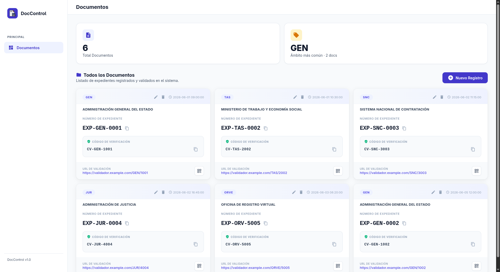

# DocControl

Panel de gestión documental con interfaz de tarjetas, CRUD vía modales y navegación dinámica con HTMX.

## Capturas



## Requisitos

- Python 3.10+
- MySQL 8.0+
- pip

## Variables de entorno

Crear un archivo `.env` en la raíz del proyecto:

```env
DB_USER=root
DB_PASSWORD=tu_contraseña
DB_HOST=localhost
DB_PORT=3306
DB_NAME=doc_control
```

## Esquema de base de datos

```sql
CREATE DATABASE doc_control CHARACTER SET utf8mb4 COLLATE utf8mb4_unicode_ci;

USE doc_control;

CREATE TABLE documento (
    id INT AUTO_INCREMENT PRIMARY KEY,
    ambito VARCHAR(50) DEFAULT NULL,
    organismo VARCHAR(255) DEFAULT NULL,
    codigo_verificacion VARCHAR(255) DEFAULT NULL,
    fecha_hora DATETIME DEFAULT NULL,
    expediente_numero_registro VARCHAR(255) DEFAULT NULL,
    direccion_validacion VARCHAR(500) DEFAULT NULL
);
```

## Instalación y ejecución

```bash
# Clonar el repositorio
git clone <repo-url>
cd doc-control

# Crear y activar entorno virtual
python3 -m venv venv
source venv/bin/activate

# Instalar dependencias
pip install -r requirements.txt

# Configurar variables de entorno
cp .env.example .env   # editar con credenciales reales

# Iniciar servidor
python app.py
```

El servidor arranca en `http://localhost:5000`.

## Descarga de archivos

Cada tarjeta de documento incluye un botón de descarga que muestra los PDFs asociados al registro desde la carpeta `certs/`. Para que los PDFs descargados desde cada entidad sean válidos deben renombrarse siguiendo la nomenclatura establecida:

- El nombre base se toma del **número de expediente**; si el registro no tiene expediente, se usa el **código de verificación**.
- Se normaliza reemplazando todo carácter especial (que no sea `-`) por `-`.
- Un registro puede tener varios archivos: `{base}.pdf`, `{base}_1.pdf`, `{base}_2.pdf`, etc.

## Tecnologías

- **Flask** — backend y rutas
- **SQLAlchemy + PyMySQL** — acceso a MySQL
- **HTMX 2** — navegación dinámica sin JavaScript pesado
- **Jinja2** — templates con partials
- **CSS nativo** — sin frameworks, con variables de diseño
- **Material Icons** — iconografía

## Licencia

MIT
